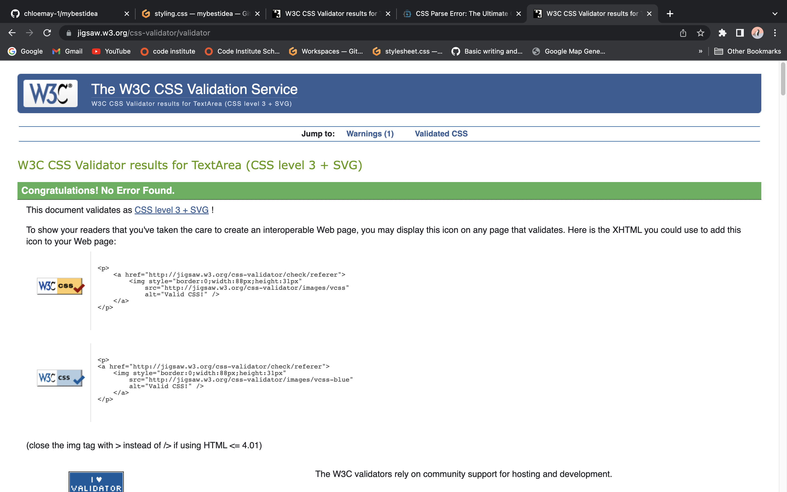

# Scamps Groomers

## Purpose of Website
This website was designed to provide users with information about a dog groomers called Scamps. This website should be easy to navigate and have easy flow for users. Users should be able to find treatment and prices easily, with help from a navagation bar. This website should hold images of work done and a map of location.

I plan on attaching a form for users to add their details and dogs details, and our team will get back to them to arrange an appointment. Alternatevly call the number, email us, or drop by the store and we will be happy to help.  I hope to acheive this. 

[Scamps Groomers Deployed link](https://chloemay-1.github.io/mybestidea)

## User Goals
* As a current user, I wish to see a website that is functional on all devices. 
* As a current user, I wish to see a well created website that is visually appealing on all devices. 
* As a current user, I wish to see a website that is easy to navigate for users.
## As a new customer
* As a new customer, I wish to see pricing clear on the website.
* As a new customer, I wish to see images of previous work.
* As a new customer, I wish to be able to contact the company easily. 
* As a new customer, I would like to be able to leave a review for the service if I wish. 
## As a site owner 
* As a site owner, I wish new customers are able to easily navigate the information on the website, and find what they are looking for. 
* As a site owner, I wish for old customers to easily be reminded of ours details such as phone number, up to date pricing, and where to find us.
* As a site owner, I wish the site promotes my business online, and attracts new customers. 
## Expectations
* I expect the website to work as intended on all devices and hold the same flow. 
* I expect the website to tell me if the form has been submitted, and if details are filled in correcttly. 
* I expect the website to have social links that all open in a new tab. 
* I expect all links on the website to have a function, and complete that function. 
* I expect all information on the website to be accurate for customers to avoid a bad experience. 

# Design Choices 
 
 ## Colors

 I initially was quite stuck on picking a color palette, I picked some basic red and orange colors and used the color wheel to get more detailed shades I felt matched.
 I first had color palette of
 * #efbb0fc1
 * #f57e23
 * #e0770c
 * #ffff4a
 * #9565q8
 * e3f0e4
 
 
 Toward the end of compeleting my project, I was not extremelly happy with how everything was looking together. Something about it wasnt sitting right with me.
I decided to add a background color to the DIVS in the main body for about us, price list, and contact us. To pick the color for the background I used color dropper to take the 2 shades of brown from the paw prints in the header. This left me with 2 colors. 
 * #d0867c
 * #bf786a

I added these colors to the divs, and then my font color was hard to read (#e0770c). For convinence until I decided to change the font color in the body to white #ffffff. This was a temporary move while I contemplated my color palette. 
 ### My inital color palette
 
 
 
 I was not happy with the way the colors above highlighted eachother, and felt it was too much on the eye of the user. 

 I decided to use colormind to help with a decision. I uploaded the picture of the paw print, and generated a few different pallets, although these pallets were very dark. See example of dark color palette. 
 

 ### My final color palette 
  I decided to try search for a pallet that holds a similar color too #d0867c
 This left me with a palette of 
 * f6f9f7
 * b1bdba
 * f78061
 * dd9273
 * 3d4b47

 
 I tested out multiple different combinations of the palette I chose, and finally decided which color for which aspect. 

 ## Features
### Body
I decided to keep the background color #e3f0e4, from my orginal palette, I felt this color was quite soft and worked well with all colors in the new palette. I felt this color does not draw away from the main aspects of the website. 
 ### Header
 I decided to have the header background color the same color as the rest of the body #e3f0e4. I felt the contrast between this shade and the shade I have chosen for the font #3d4b4f is enough that your eyes dont get lost between them, but isnt too strict that you feel its in your face. I feel this background works well also with the shades of the pawprints. 
 
 ### Nav
I choose a bright background color for my nav bar #f78061. I really enjoyed the contrast to break up the header and the main body of the website. I feel it draws your eyes down the page. I used the off white shade #f6f9f7 for my font. I feel this is easily readable. 
 
 I added the light grey color #b1bdba from my palette for the hover element of the nav bar. I feel this grey is just enough to flag you are hovering over a link.
 
 ### Body
 I start off my body by welcoming users to the website, using the same shade as my header font #e3f0e4. 

 I use 3 sections in my main body element. 
 * About Us
 * Prices
 * Contact us

 For my main three sections I used two background colors. The first and last section have a background color of #bf786a, and the middle section has a background color of #d0867c. Both of these shades come from using [Google Eye Dropper](https://chrome.google.com/webstore/detail/eye-dropper/hmdcmlfkchdmnmnmheododdhjedfccka?hl=en) on the pawprint image in the header. I used this before I decided to move away from my original color pallete of oranges/reds.
 #### Form
 I added a form to the contact us section of the website. This gives users the option to send their contact details, and a team member will be in contact shortly. 
 
 I added the same styling to the Submit and Reset buttons of the form as I did to the nav elements. 

 

 If a user enters an invalid email they will not be about to proceed with submission. 

 

 If a user enters other characters that are not numbers to both Numbers of Dogs, and Phone Number, they will not be able to proceed with submission.

 

 ### Footer

 ## Typography 
 This website uses the fonts Kaushan Script, and Lemonada, which were imported from [Google Fonts](https://fonts.google.com/). I used both of these fonts in cursive as I think its adds an elegance to the website. I used Kaushan Script in cursive for my headings and the nav bar as I felt with letter spacing these would be easy to read and would not be off putting as they are not chunks of text. 
 I used Lemonada in cursive for all other element of the webiste, although the font is cursive, it holds a very slight slant. I find this easy to read as well as matching Kaushan Script cursive, as they both hold a slant. 

 ## Imagery
 The imagery used in the website is used to make the user aware from the get go, this is a website to do with animals (especially dogs). From the paw prints in the header, to the image of a dog groomer showing another younger woman the way. This image was used to show Scamps is a family run business with good connection within. I used the image of a dog in the bath next to the price list, as having a bath is included in most grooms. I would have liked to have a gallery of some before and after pictures, although I could not achieve this with the free images available online. I used a fun image of a dog on my form submittion page, there is nothing to do on the submission page and I thought this image added to the page well. 

 Images were sourced from [Pexels](https://www.pexels.com/)
## Wireframe 

### Phone

* [Phone One](../mybestidea/wireframes/phone/phone1.png "Phone One")

* [Phone Two](../mybestidea/wireframes/phone/phone2.png "Phone Two")
* [Phone Three](../mybestidea/wireframes/phone/phone3.png "Phone Three")
* [Phone Four](../wireframes/phone/phone4.png "Phone Four")

### Computer
* [Computer One](wireframes/wireframe/computer/computer1.png "Computer One")
* [Computer Two](wireframes/wireframe/computer/wireframecomputer2.png "Computer Two")
* [Computer Three](wireframes/wireframe/computer/wireframecomputer3.png "Computer three")
* [Computer Four](wireframes/wireframe/computer/wireframecomputer4.png "Computer four")

Wireframes were made using [Balsamiq](https://balsamiq.com/)
### Deployment 

Following writing the code, adding, commiting, and pushing to github, I followed the following steps to deploy my website 
* Opened mybestidea repository on github .
* Opened settings and scrolled down to find pages on the left hand side.
* On first attemp of trying to delploy I realised I needed to make my repository public .
  * I done this by scrolling to end of the settings page to ***danger zone*** and changed visibility to public.
* I then scrolled back up and to pages and changed branch to main. 
* I then clicked the save button.
* Within a few moments my link was live.

[My Live Link](https://chloemay-1.github.io/mybestidea/)
### Testing

 I found that Chrome dev tools was a great help to see the placement of items and for using smaller screens, although I found once I had deployed my website and I started opening it on my own device, and asking family and friends to check out my website on any and all devices in their homes it wasnt working to same extent as it shows on the dev tools. I found this may be due to the fact most phones are touch screens. For eg, my nav bar was very difficult to use on actual phones, although from the dev tools this wouldnt have been noticed. I fixed this error by added word spacing, and made list into a column.  

I found an issue to be on the deployed site, on certain phones (Samsung) there was a horizontal nav bar that had no use. The friends/family who have Samsungs all said they could not use this scroll bar unless they zoomed into the website, then the scroll bar grew and they could us it. I found this one of my toughest issues to try and fix. Toward the end of my project this was still in issue on some samsung smart phones, but not all according to my family and friends. 

When I changed used chrome Dev tools and changed to samsung smart phone, there was no horizontal scrool. 
### CSS and HTML Validator
#### CSS

I used [W3C CSS Validator](https://jigsaw.w3.org/css-validator/#validate_by_uri) to check my css code. 

When I first sent my CSS code into the validator I got 7 issues. 5 of them being pearse issues, which were simple fixes. The other 2 issues were also quick fixes, I had missed unit after width and height for one element.

After fixing these errors I sent my code through again and was given No Errors Found

#### HTML

I used [W3C HTML Validator](https://validator.w3.org/) to check my HTML code. 

When I first used the HTML Validator I was shown 5 errors. 3 errors were stray tags through-out the code, which was a quick fix. 

I removed the stray tags from my code.
I removed the target=_blank from my submit button. This made no difference to its function.
I removed the code that was causing the error. Changed the h1 that was causing an issue to a H2 and styled accordingly.

I tested my HTML code again and got No Errors. 

 I found another limitation to be finding photos of dog grooming, before and after pictures. A lot of photos that could have been used I would have to pay for. I mainly sourced my images from pexels for free. 

I found in the deployment if my website onto phone screens, that samsung phone were giving a horizontal scroll bar, but it has no use unless you zoomed into the website. I did not find this on any iPhone that my project was opened on. I used dev tools, and my very own class mentor Simen Daehlins very useful extension Unicorn revealer to show what the issue may have been. It seems the nav bar was my issue. I attepted to fix same. 
